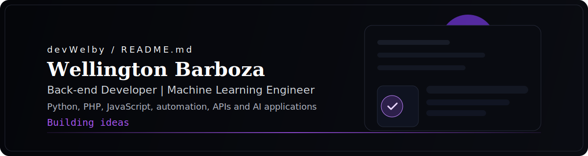

 

### Hello, I'm Wellington 👋

**Back-end Developer**  
**Machine Learning Engineer**  
**Python | PHP | JavaScript**

---

## 🟪 About me

I am a **Back-end Developer** and **Machine Learning Engineer** focused on turning ideas into clean, scalable, and well-designed digital products.

I work from **back-end to automation**, prioritizing clean architecture, code organization, and practical delivery.

I am currently building projects that combine APIs, automation flows, data-driven features, and real product thinking.

> **Main profile:** Python, PHP, JavaScript, and modern web solutions  
> **Technical interests:** system architecture, APIs, automation, and AI applications  
> **Workflow:** GitHub, pull requests, code review, and structured delivery  
> **Beyond code:** building useful products with clear business value

---

## 🟪 Tech Stack

### ✦ Front-end & Web

### ✦ Back-end

### ✦ Infra & Workflow

---

## 🟪 Contacts

---

